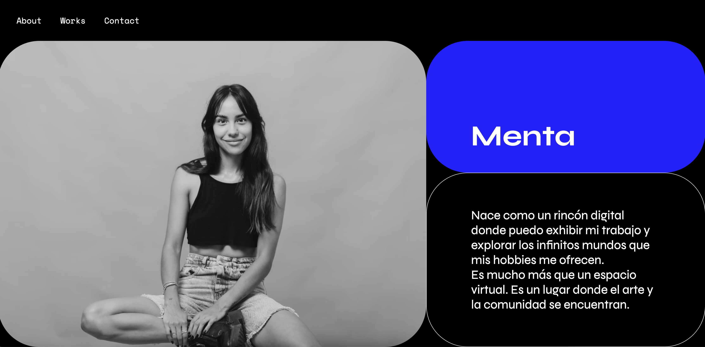

# js-animacion

This blog was created as the final project for Domestika's course by Yannick Gregorie. In this course, I learned to develop an animated web page using JS, CSS, and HTML.

I decided to create Menta, a personal blog to share my hobbies: pottery, live coding, and design. Menta is a virtual space where I showcase my work outside the office.

Finally, during the course, I also learned how to animate objects without frameworks and look trends and inspiration.

## deploy 🚀
['Menta Vercel'](url completa)

